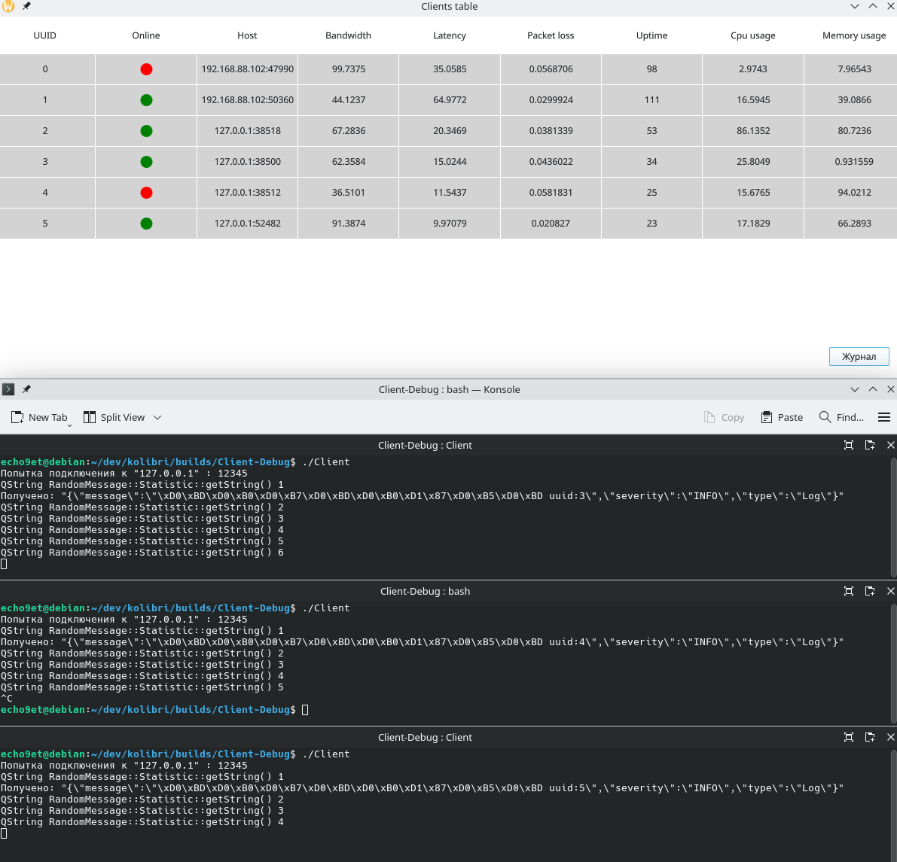

# Kolibri

Кросс-платформное приложение на основе Qt с архитектурой TCP клиент-сервер и графическим интерфейсом мониторинга.

## Описание проекта

Состоит из двух основных компонентов:

- **Client**: Легкое TCP клиент-приложение, которое подключается к серверу и отправляет данные
- **Server**: GUI приложение (построено на QML) которое слушает входящие соединения от клиентов и отображает метрики в реальном времени

## Возможности

- **Мониторинг в реальном времени**: Отслеживание подключенных клиентов и их сетевых метрик
- **Система логирования**: Логи сервера и отдельные логи для каждого клиента
- **Сетевые метрики**: Мониторинг статуса устройства и производительности сети
- **Потокобезопасность**: Сервер работает в отдельном потоке для предотвращения блокировки UI

## Скриншот



## Системные требования

- **Qt**: 6.5 или выше
- **C++ Standard**: C++17
- **CMake**: 3.19 или выше

## Структура проекта

```
kolibri/
├── Client/                 # TCP клиент приложение
│   ├── CMakeLists.txt
│   ├── README.md
│   └── src/
│       ├── main.cpp
│       ├── client.cpp
│       └── client.h
├── Server/                 # GUI сервер приложение
│   ├── CMakeLists.txt
│   ├── README.md
│   ├── src/
│   │   └── server/
│   │   └── storage/
│   └── frontend/          # QML пользовательский интерфейс
│       ├── Main.qml
│       ├── Logs.qml
│       └── TableClients.qml
```

### Типы объектов (src/entities.h)

- `ENTITIES::InfoConnection` - информация о подключении клиента
- `ENTITIES::NetworkMetrics` - сетевые статистики
- `ENTITIES::DeviceStatus` - статус устройства
- `ENTITIES::Log` - лог-данные

## CI/CD

Проект использует GitHub Actions для автоматической сборки на Windows:
- Конфигурация: `.github/workflows/main.yml`
- Развертывание: Автоматическое развертывание зависимостей Qt с помощью windeployqt

## Документация

- [Документация Client](Client/README.md)
- [Документация Server](Server/README.md)

## Лицензия

См. файл LICENSE для подробностей.
